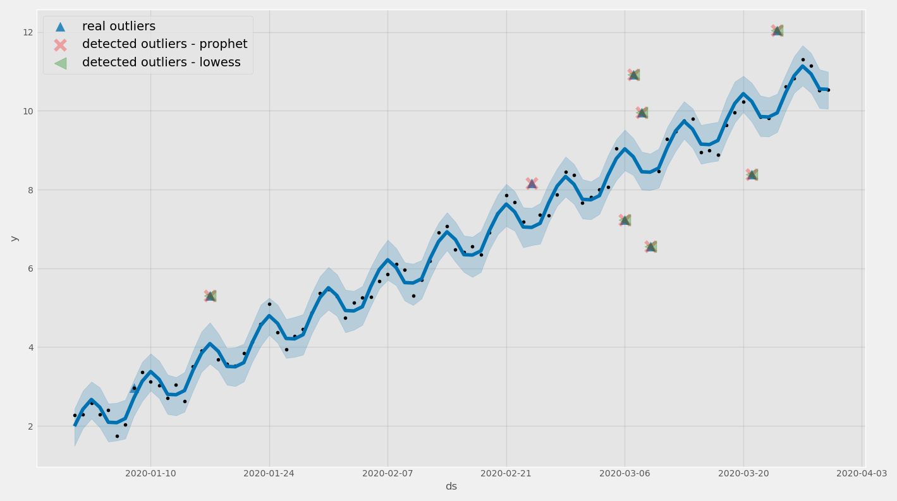

# Time Series Outlier Detection API for AWS
Outlier detection for time series, with semi-automatic integration for deployment as an AWS API.  
  
## Description
The outlier detection is implemented using [fbprophet](https://facebook.github.io/prophet/) and [lowess](https://www.statsmodels.org/dev/generated/statsmodels.nonparametric.smoothers_lowess.lowess.html).

The AWS integration is implemented using basic [Cloudformation](https://aws.amazon.com/cloudformation/). The integration has some "manual" steps as some steps require files to be available in S3.

## Outlier Detection Algorithms
There are two different algorithms. Both iteratively fit a model and exclude points which are considered outliers. 
1. Fbprophet: Points which are outside the chosen confidence interval are considered outliers. 
2. Lowess based: Points which are far from the lowess fit compared to nearby points are considered outliers.

## AWS Integration
The API is deployed as a docker image ([ECR](https://aws.amazon.com/ecr/) & [CodeBuild](https://aws.amazon.com/codebuild/)). The API uses [Lambda](https://aws.amazon.com/lambda/) with an [API Gateway](https://aws.amazon.com/api-gateway/).  

## Installation
### Prerequisites
You will need to have [AWS CLI](https://aws.amazon.com/cli/) installed, and credentials configured with permissions for:
- Cloudformation
- IAM policies / roles
- S3
- ECR
- CodeBuild
- Logging
- Lambda 
- API Gateway

### Clone repository
`git clone https://github.com/Rotaro/TimeSeriesOutlierDetection`

### API deployment with cloudformation
Follow the steps in [build_steps_cloudformation](build_steps_cloudformation.sh). If you run the file, you might want to comment out the cleanup part! 

## Using the API
The api expects json requests with the following structure:
```json
{
 "dates": [
  "2020-01-01",
  ...
 ],
 "dates_format": "%Y-%m-%d",
 "target": [
  1.7720652447488892,
  ...
 ],
 "target_dtype": "float",
 "method": "prophet",
 "method_kws": {},
 "n_rounds_max": 10
}
```
Responses have the following structure:
```json
{
 "dates": [
  "2020-01-01",
  ...
 ],
 "prediction": [
  x.xx,
  ...
 ],
 "prediction_upper": [
  x.xx,
  ...
 ],
 "prediction_lower": [
  x.xx,
  ...
 ],
 "outlier": [
  true, 
   ...
 ]
}
```
